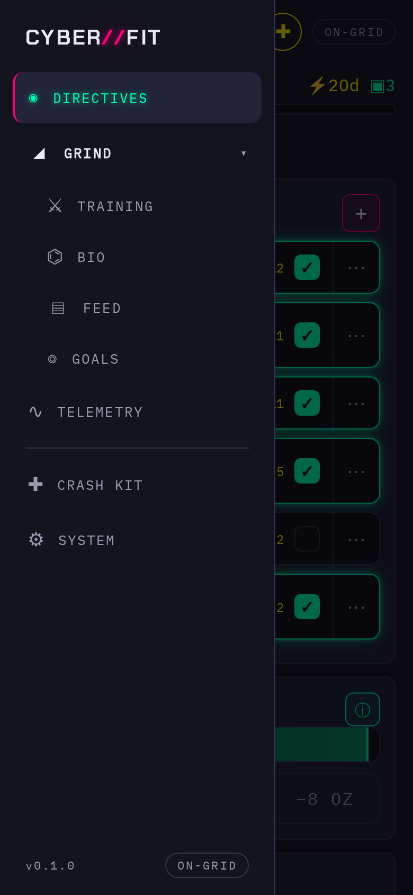
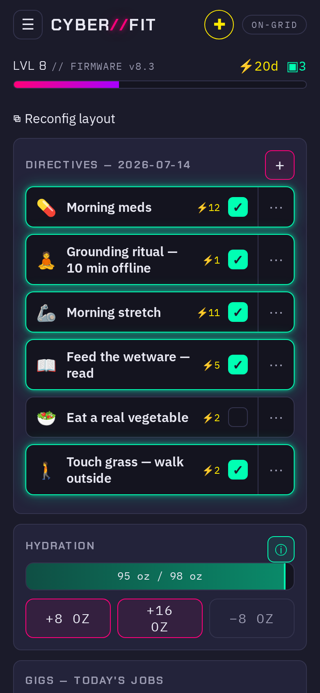
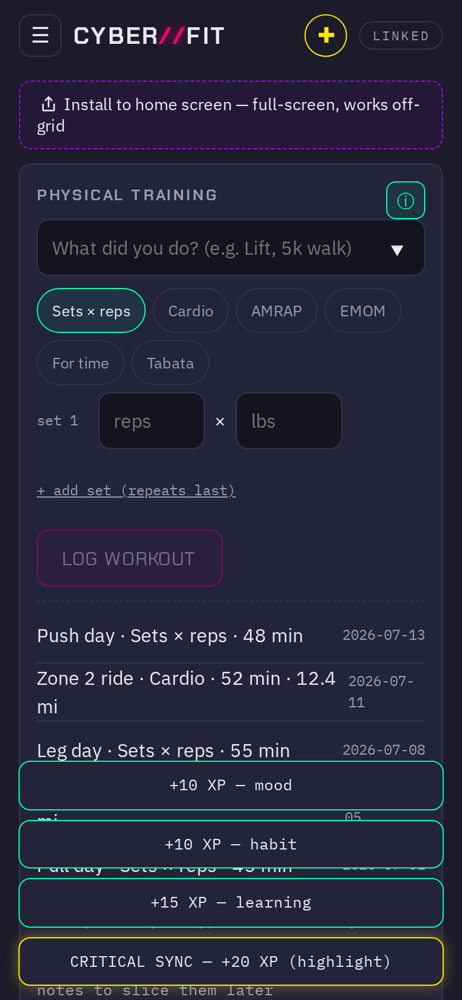
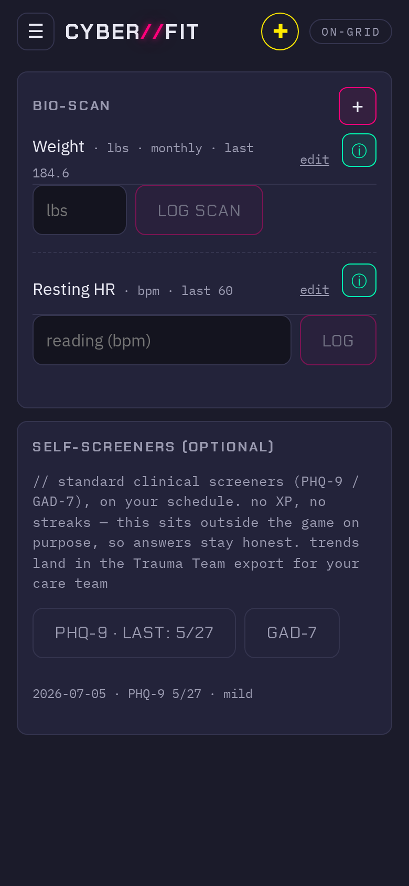
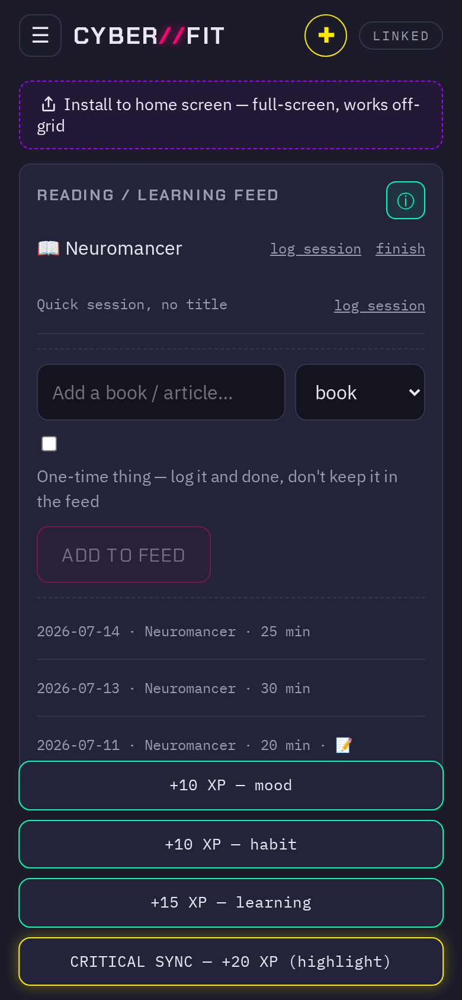
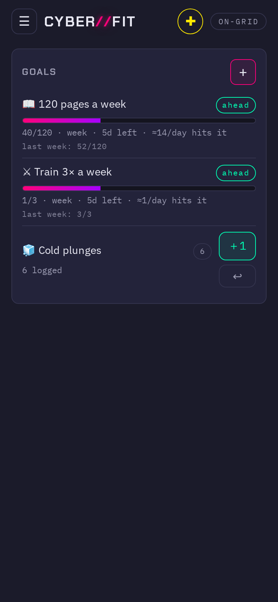
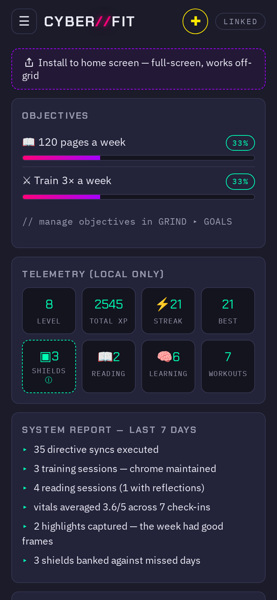
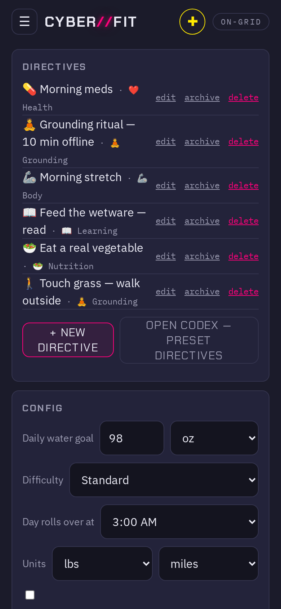
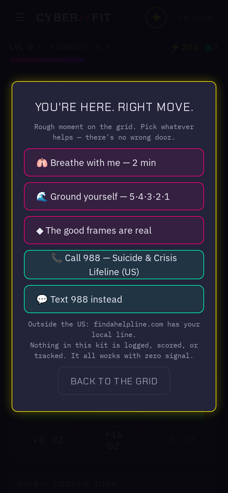

# CYBER//FIT — User Guide

CYBER//FIT is a habit tracker that runs entirely on your device. No account,
no server, no analytics — everything you log lives in your browser's local
database and never leaves it unless *you* export it. Install it to your home
screen and it works with zero signal.

The one rule the whole app is built around: **it never shames you.** Missed
days don't wipe your progress, streaks have shields, and the mental-health
tools sit outside the game entirely so you're never tempted to lie to them.

> The screenshots below come from a fictional demo profile
> ([`demo-profile.json`](demo-profile.json)) — no real person's data.

---

## Getting started

1. Open the app in your browser.
2. Tap **Install to home screen** (the dashed banner up top). This gives you
   full-screen mode and offline use — the app is a PWA, so after install it
   works completely off-grid.
3. First run walks you through calibration: pick a few starter directives,
   then **Jack in**.

Navigation lives behind the **☰ menu** (top left). The **＋** button (top
right) is quick-log from anywhere. The **LINKED** badge shows connection
status — the app doesn't need a connection, so "offline" is a state, not an
error.

- **DIRECTIVES** — your daily habits (the home screen)
- **GRIND** — Training, Bio, Feed, and Goals
- **TELEMETRY** — your stats
- **SYSTEM** — settings, backups, and habit management
- **RECONFIG** — reorder and tune your day

---

## Directives — your daily list

Each directive is one habit for today. Tap the check to sync it and earn XP;
tap **⋯** for notes, skip, and details. The **＋** button adds a one-off or a
new recurring directive.

What the numbers mean:

- **LVL / FIRMWARE** — your level and progress bar. XP only ever goes up.
  Leveling is slow and steady on purpose; there's nothing to lose.
- **⚡ 21d** — your current streak.
- **▣ 3** — streak shields. Miss a day and a shield is spent automatically;
  your streak survives. Shields regenerate as you show up. A broken streak is
  a number resetting, not a judgment — the XP and history all stay.
- **CRITICAL SYNC** — occasionally a directive is worth bonus XP. It's a
  highlight, never a punishment for skipping.

**Hydration** sits below the list: a running total against your daily goal
with quick ± buttons. The goal and units are yours to set in System.

## Training — log workouts your way

Free-text what you did, pick a format — **Sets × reps, Cardio, AMRAP, EMOM,
For time, Tabata** — and log it. Sets repeat the last entry so logging
5×5 takes five taps. History lists every session with date, format, and
duration; keep notes now, slice them later.

There's no "missed workout" state. The app counts what you did, not what you
didn't.

## Bio — vitals and optional self-screeners

**BIO-SCAN** tracks whatever body metrics you choose (weight, resting HR,
blood pressure…), each on its own cadence — weight monthly is fine; the app
will never nag you to weigh in daily.

**SELF-SCREENERS** are standard clinical instruments (PHQ-9, GAD-7) on your
schedule. Deliberately: **no XP, no streaks**. They sit outside the game so
your answers stay honest — inflating a mood score to keep a streak alive
would defeat the whole point. Trends land in the Trauma Team export
(see System) for your care team, if and when you choose to share.

## Feed — reading and learning

Books, articles, videos, audiobooks, classes — add them to the feed and log
sessions against them, or log a quick session with no title. One-time things
can be logged and done without cluttering the feed. Finished items move to
your history with total time.

## Goals — weekly targets

Set targets like *120 pages a week* or *Train 3× a week*. The badge tells you
if you're **ahead** or behind pace for the period — pace, not perfection. A
missed week just starts a new week.

## Telemetry — your data, summarized

Objectives progress, lifetime stats (level, total XP, streak, best, shields),
and a plain-language **System Report** for the last 7 days. It's labeled
**LOCAL ONLY** because it is: these numbers are computed on your device from
your device.

## System — settings, backups, and your data

- **Directives** — edit, archive, or delete any habit. Archive keeps its
  history; delete really deletes.
- **Config** — daily water goal, difficulty, units, and **Day rolls over
  at** (default 3:00 AM, because a habit checked at 1 AM still belongs to
  *your* yesterday).
- **Backups** — export your entire profile as a single JSON file, import it
  on any device. This is the whole sync story: a file you own.
- **Trauma Team export** — a separate, clinician-friendly export of your
  screener trends and vitals for appointments.

## The Crash Kit

Tap **Open crash kit** from anywhere when you're having a rough moment. It
offers paced breathing, 5·4·3·2·1 grounding, a reminder that the good frames
are real, and one-tap **call or text 988** (US) — with
[findahelpline.com](https://findahelpline.com) for everywhere else.

Nothing in the kit is logged, scored, or tracked, and it all works with zero
signal. Reaching for it is the right move, not a stat.

---

## Privacy, in one paragraph

Your data lives in IndexedDB in your browser. There is no account, no cloud,
no telemetry-that-phones-home. Exports happen when you tap export; imports
happen when you pick a file. If you clear your browser storage without an
export, the data is gone — so back up occasionally. That's the trade, and
it's yours to make.
